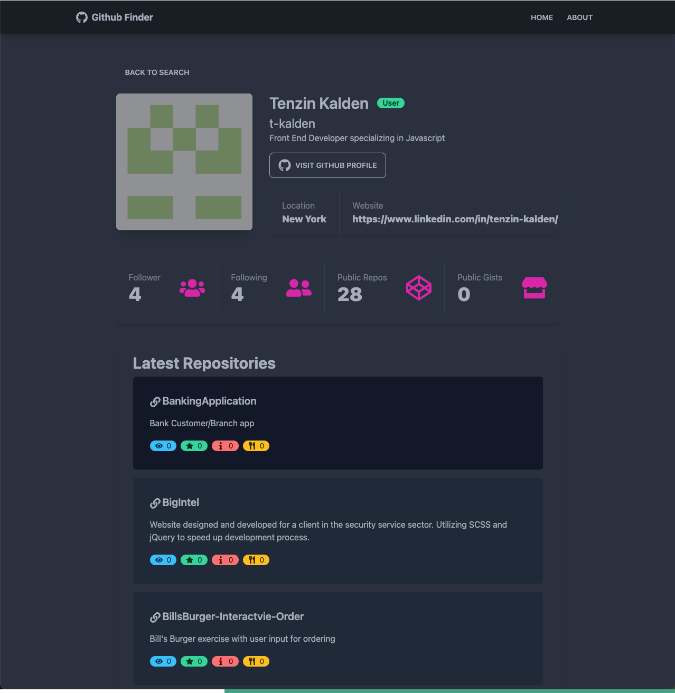

# Github Finder App

## Project Overview

A GitHub search application utilizing Tailwind and Daisy UI for front end design, and making API calls to GitHub API to search and display GitHub user's profile and repos. 

### Home 

### Search 

### Repo 

### `npm start`

Runs the app in the development mode.\
Open [http://localhost:3000](http://localhost:3000) to view it in your browser.

The page will reload when you make changes.\
You may also see any lint errors in the console.

